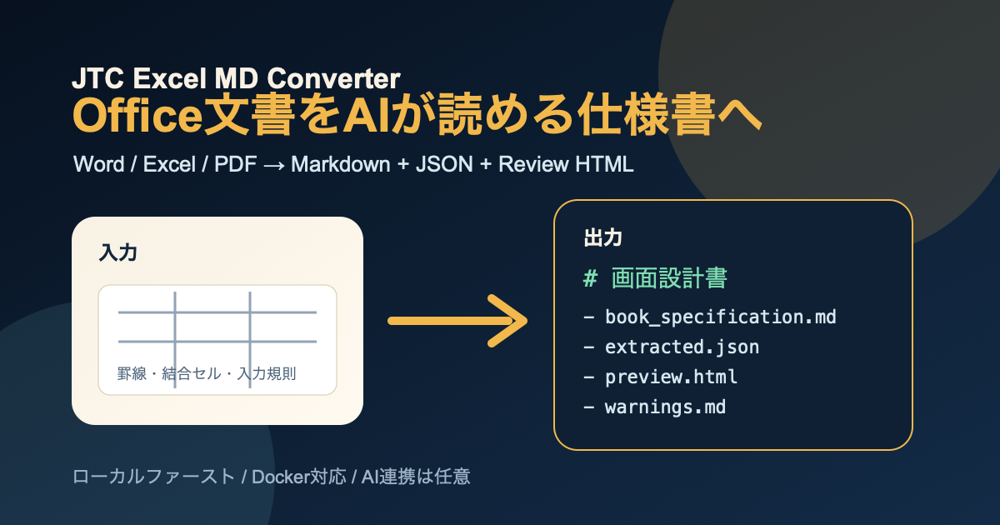

# JTC Excel MD Converter

Word / Excelで作られた業務文書を、Markdownドキュメントとして読める形に変換するローカルファーストなOSSツールです。

JTC企業でよく使われるWord / Excelの業務文書を、まずMarkdownへ変換します。Excel方眼紙に埋もれた罫線、結合セル、セル座標、入力規則、コメント、Word文書の見出し・段落・表を読み取り、人がレビューしやすいMarkdownドキュメントとして出力します。テキストPDFにも対応しています。



## まず確実にできること

- Excel設計書をブック単位でMarkdownドキュメント化
- Word `.docx` をMarkdownドキュメント化
- テキストPDFをMarkdownドキュメント化
- 罫線・結合セル・見出し・表・入力規則・コメントをMarkdownへ反映
- 変換結果を `book_specification.md` として出力
- 通常変換では外部AI/APIへ文書内容を送信しない

補助的に、元文書との対応確認用の `preview.html`、機械処理用の `extracted.json`、要確認事項をまとめた `warnings.md` も生成します。

## デモ動画

<video controls src="docs/assets/demo-zundamon.mp4" title="JTC Excel MD Converter デモ"></video>

動画が表示されない場合は、こちらを直接開いてください。

[デモ動画を開く](docs/assets/demo-zundamon.mp4)

## 変換例

詳しいBefore/Afterは [Before / After サンプル](docs/before-after-sample.md) にまとめています。

入力側のExcel設計書では、見た目の配置だけでなく、罫線・結合セル・入力規則・セル座標に仕様情報が入っていることがあります。

```text
B2:H2  画面設計書：ログイン画面
B4:F7  項目 / 内容 / 必須 / 入力方式 / 備考
E5:E7  テキスト / パスワード / チェックボックス / ラジオ
```

このツールは、そうした構造を読み取り、Markdown仕様書として出力します。

```markdown
# 画面設計書：ログイン画面

| 項目 | 内容 | 必須 | 入力方式 | 備考 |
| --- | --- | --- | --- | --- |
| ユーザーID | 社員番号またはメール | ○ | テキスト | 半角英数 |
| パスワード | 8文字以上 | ○ | パスワード | マスク表示 |

### 入力規則
- E5:E7: テキスト / パスワード / チェックボックス / ラジオ
```

主な成果物はMarkdownドキュメントです。確認用にJSON、HTML、warningsも併せて出力します。
```text
outputs/jtc_screen_design/
├── book_specification.md  # 統合Markdown仕様書
├── extracted.json         # セル範囲・表・入力規則などの構造化データ
├── preview.html           # 元文書との対応を確認するHTML
├── warnings.md            # 人間レビューが必要な項目
└── package.zip            # 成果物一式
```

`warnings.md` には、変換結果をそのまま信じ切らないための確認事項が出ます。

```text
- 画面設計書: 結合セル B2:H2 を見出しとして解釈しました。
- 画面設計書: コメント付きセル F5 は人手確認してください。
```

## 対応できること / まだ苦手なこと

このツールは、Word / Excel業務文書をMarkdownドキュメント化するための一次変換ツールです。元文書の構造をできるだけ取り出し、人が読んで確認できるMarkdownにすることを目的にしています。

| できること | まだ苦手なこと |
| --- | --- |
| Excelの罫線ブロックをMarkdown表に変換 | 図形や画像の意味解釈 |
| 結合セルのタイトルを見出しとして抽出 | スキャンPDFや画像内文字のOCR |
| 入力規則・コメント・セル座標をMarkdownに反映 | Office上の厳密な見た目や重なり順の再現 |
| Wordの見出し・段落・表をMarkdown化 | 文脈を読んだ設計意図の自動補完 |
| 未対応・曖昧な内容をwarningsへ分離 | 変換結果を人手確認なしで完成仕様書にすること |

つまり、完璧な文書理解AIではありません。まずローカルで安全にMarkdownへ変換し、`preview.html` と `warnings.md` で人間が確認できる状態にします。

## ローカル実行

```bash
python -m venv .venv
source .venv/bin/activate
pip install -e .
jtc-md-convert examples/jtc_screen_design.xlsx --out outputs/jtc_screen_design
```

Wordファイルも同じコマンドで実行できます。

```bash
jtc-md-convert path/to/design.docx --out outputs/word_design
```

PDF対応は `PyMuPDF` を使うため任意extraに分けています。PDFを変換する場合だけ、次のように入れてください。

```bash
pip install -e '.[pdf]'
jtc-md-convert path/to/design.pdf --out outputs/pdf_design
```

生成される主なファイルは以下です。中心となる成果物は `book_specification.md` です。

- `book_specification.md`: 統合Markdown仕様書
- `specification.md`: 互換用のMarkdownファイル名
- `extracted.json`: 抽出した構造化データ
- `warnings.md`: 人間レビューが必要な項目
- `preview.html`: 元文書との対応を確認するHTML
- `package.zip`: 成果物一式

## Docker実行

Python環境を作らずに試す場合はDockerを使います。

```bash
docker build -t jtc-excel-md-converter:local .
mkdir -p outputs
docker run --rm \
  --user "$(id -u):$(id -g)" \
  --workdir /work \
  -v "$PWD/examples:/work/examples:ro" \
  -v "$PWD/outputs:/work/outputs" \
  jtc-excel-md-converter:local \
  examples/jtc_screen_design.xlsx --out outputs/docker-smoke
```

Composeでも実行できます。

```bash
docker compose run --rm jtc-md-converter
```

LinuxでUID/GIDが `1000:1000` ではない場合は、次のように指定してください。

```bash
env UID="$(id -u)" GID="$(id -g)" docker compose run --rm jtc-md-converter
```

WindowsではWSLまたはGit Bashでの実行を推奨します。必要に応じて `docker run --user` の指定を利用環境に合わせてください。

Dockerの実行確認スクリプトもあります。

```bash
scripts/docker_smoke.sh
```

## ローカルデモUI

ブラウザで変換結果を確認するローカルUIを起動できます。

```bash
jtc-md-demo examples/jtc_screen_design.xlsx --out outputs/demo-app --port 8765
```

ブラウザで以下を開きます。

```text
http://127.0.0.1:8765/
```

このデモはローカル処理のみで、外部LLM/APIへ文書内容を送信しません。シート一覧、抽出プレビュー、統合Markdown、構造化JSON、レビューHTML、warnings、ZIPダウンロードを確認できます。

画面スモークテストは以下です。

```bash
python scripts/smoke_demo_ui.py
```

## 任意のAI連携

AI支援は任意です。初期状態では外部APIへ文書内容を送りません。

設定する場合は `.env.example` をコピーします。

```bash
cp .env.example .env
```

OpenAI互換エンドポイントを利用する例です。

```text
JTC_AI_PROVIDER=openai-compatible
JTC_AI_API_KEY=your-api-key
JTC_AI_BASE_URL=http://127.0.0.1:11434/v1
JTC_AI_MODEL=qwen2.5-coder:7b
```

対応予定を含むプロバイダ値は以下です。

- `openai`
- `anthropic`
- `google`
- `openai-compatible`
- `ollama`
- `lmstudio`
- `local`

変換成果物にAI設定の安全な概要を含める場合は、次のように実行します。

```bash
jtc-md-convert examples/jtc_screen_design.xlsx \
  --out outputs/jtc_screen_design \
  --ai-env-file .env \
  --show-ai-config
```

出力にはプロバイダ名、モデル名、安全化したベースURL、APIキー設定有無だけを記録します。生のAPIキーやキーの一部は `extracted.json`、`evaluation.md`、標準出力、ZIPへ書き込みません。

AIエンドポイントへ整形を依頼する場合は、明示的に `--ai-restructure` を付けます。決定論的に生成した `book_specification.md` は上書きせず、レビュー用の `ai_restructured_specification.md` と `ai_restructure_warnings.md` を別ファイルとして出力します。

`--ai-restructure` を付けた場合だけ、抽出済みMarkdownと `extracted.json` の内容を設定したAIエンドポイントへ送信します。機密文書を扱う場合は、利用組織で承認済みのローカル/専用エンドポイントを使うか、送信可能な文書だけで実行してください。`--ai-restructure` なしの通常変換は外部LLM/APIへ文書内容を送りません。

```bash
jtc-md-convert examples/jtc_screen_design.xlsx \
  --out outputs/jtc_screen_design \
  --ai-env-file .env \
  --ai-restructure
```

## 公開サンプルで動作確認する

まず動きを確認したい場合は、公開URLから取得できるサンプル文書で変換を試せます。

```bash
python scripts/fetch_public_sample_corpus.py \
  --corpus public-sample-corpus \
  --out public-sample-evaluation-output
```

取得元URL、ファイル名、SHA-256は `public-sample-corpus/manifest.json` に保存されます。変換結果のサマリーは `public-sample-evaluation-output/evaluation_summary.json`、`evaluation_summary.md`、`evaluation_cases.csv` に出ます。

既定の公開サンプルは、pandasのExcelテスト用ファイル、calibreのDOCXデモ、W3C WAIのPDFテストファイルです。pandas由来のURLは特定commitに固定し、取得済みファイルもSHA-256で検証します。

ここで確認できるのは、公開サンプルを取得し、Markdownドキュメントへ変換できることです。特定組織の文書で同じ品質を保証するものではありません。導入判断では、利用可能な模擬文書や利用許可済み文書でも確認してください。

詳しくは [公開サンプルでの動作確認](docs/public-sample-corpus.md) を参照してください。

## 手元の文書セットで動作確認する

手元のOffice/PDF文書をまとめて確認する場合は、リポジトリ外またはGit管理対象外のディレクトリに置いて実行します。

```bash
python scripts/evaluate_private_corpus.py private-corpus --out private-evaluation-output
```

`private-corpus/` と `private-evaluation-output/` は `.gitignore` 済みです。結果サマリーは `evaluation_summary.json`、`evaluation_summary.md`、`evaluation_cases.csv` に出ます。CSV/Markdownにはフルパスを出さず、ケースIDとファイル名だけを残します。

## 対象範囲

このツールは汎用Excelレンダラーではありません。Excelをレイアウトキャンバスとして使った業務設計書を、レビュー可能なMarkdownドキュメントへ変換するためのツールです。

現時点では、Excel / Word / PDFの主要テキスト、表、罫線、入力規則、コメント、画像・図形・テキストボックスのプレースホルダー検出、AI整形の明示実行、文書セットの一括確認に対応しています。画像そのもののOCR、スキャンPDFのOCR、図形の意味解釈、Office上の厳密な重なり順再現は対象外です。未対応または曖昧な内容は `warnings.md` に出力します。

## 開発・テスト

開発時にテストも実行する場合は、開発用extraを入れます。

```bash
pip install -e '.[dev]'
python -m pytest -q
```

リリース前チェックは以下で実行できます。

```bash
python scripts/public_release_gate.py
```

## ライセンスと依存関係

このリポジトリ本体は MIT License です。

主な依存関係は `openpyxl` です。PDF対応は任意extraの `pdf` に分けており、`pip install -e '.[pdf]'` または `pip install 'jtc-excel-md-converter[pdf]'` を実行した場合だけ `PyMuPDF` が入ります。

`openpyxl` は MIT License、`PyMuPDF` は AGPL-3.0-or-later または商用ライセンスのデュアルライセンスです。配布・組み込み・商用利用の条件は利用形態により変わるため、PDF対応を含めて再配布する場合は `NOTICE.md` と各プロジェクトのライセンスを確認してください。
